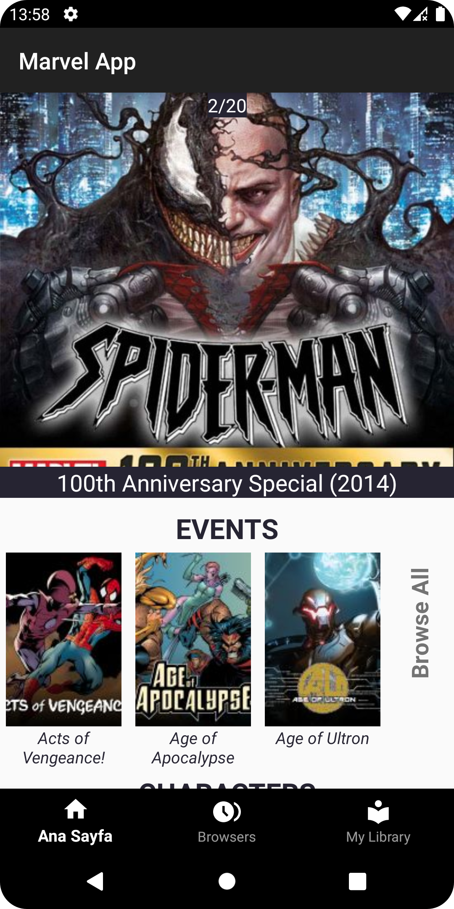
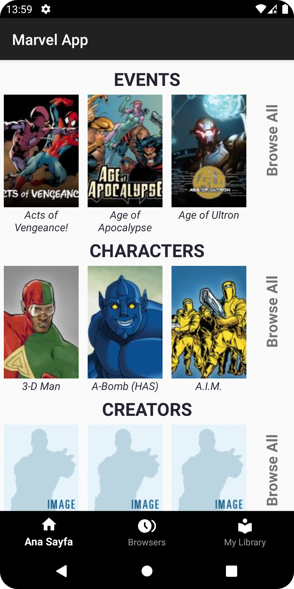
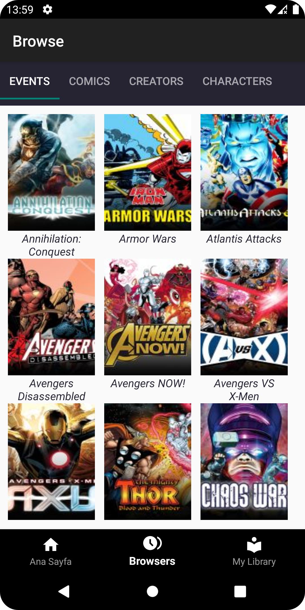
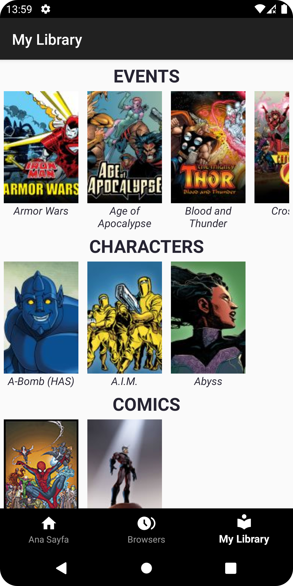
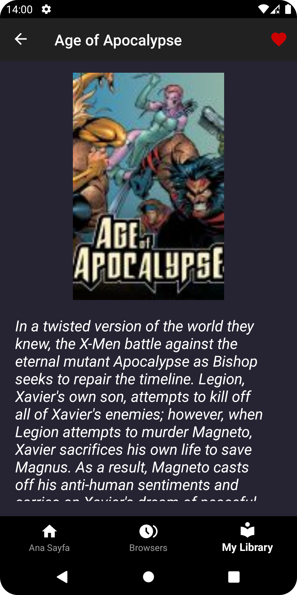

# Marvel Uygulaması

http://developer.marvel.com/ adresindeki API' yi kullanarak oluşturulan Marvel uygulaması.  
Uygulama Marvel API'sinden alınan "comics", "events", "characters", "creators" ve "series" leri listeler halinde "Home" da göstermektedir.
Kullanıcı "Browse All" a tıklayarak seçtiği kategorinin tümünü listeyebilir. Ayrıntılı incelemek istediği filmi, dergiyi vs. seçerek favori listesini oluşturabilir. "My Library" sekmesinde seçtiği filmleri, dergileri görüntüleyebilir.
"Browse" kısmında Marvel da yer tüm kategorileri görebilir.

## Mimari

Proje mimarisi olarak **MVVM (Model-View-ViewModel)** kullanılmıştır.  

MVVM, kodu modüler bir şekilde düzenlemeye olanak tanır. Model, View ve ViewModel'in ayrı tutulması, kodu daha düzenli ve sürdürülebilir hale getirir.  
**Model:** Veri tabanı, ağ istekleri veya local depolama ile ilgili işlemleri içerir. 
**View:** Aktiviteler, fragmentler aracılığı ile görsel bileşenleri içerir. 
**ViewModel:** Model ve View arasında bir bağlantı sağlar. Kullanıcı arayüzüyle ilgili işlemleri içerir ve View'i doğrudan etkilemeden, Model'den gelen verilere erişim sağlar. 

## Kullanılan Teknolojiler

- Kotlin
- MVVM
- Hilt
- Coroutines
- Retrofit
- LiveData
- Room
- Picasso
- Navigation Components
- ViewPager2
- Frgment

## Ekran Görüntüleri

   

