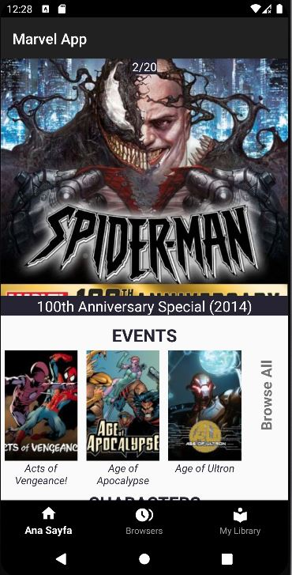

# Marvel Uygulaması

http://developer.marvel.com/ adresindeki API' yi kullanarak oluşturulan Marvel uygulaması.

## Mimari

Proje mimarisi olarak **MVVM (Model-View-ViewModel)** kullanılmıştır.  

MVVM, kodu modüler bir şekilde düzenlemeye olanak tanır. Model, View ve ViewModel'in ayrı tutulması, kodu daha düzenli ve sürdürülebilir hale getirir.  
**Model:** Veri tabanı, ağ istekleri veya local depolama ile ilgili işlemleri içerir. 
**View:** Aktiviteler, fragmentler aracılığı ile görsel bileşenleri içerir. 
**ViewModel:** Model ve View arasında bir bağlantı sağlar. Kullanıcı arayüzüyle ilgili işlemleri içerir ve View'i doğrudan etkilemeden, Model'den gelen verilere erişim sağlar. 

Aşağıdaki diyagram tüm modülleri ve her modülün daha sonra birbirleriyle nasıl etkileşime girdiğini göstermektedir.

## Projede kullanılan teknolojiler

## Ekran görüntüleri
